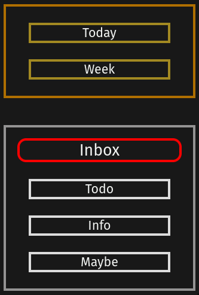
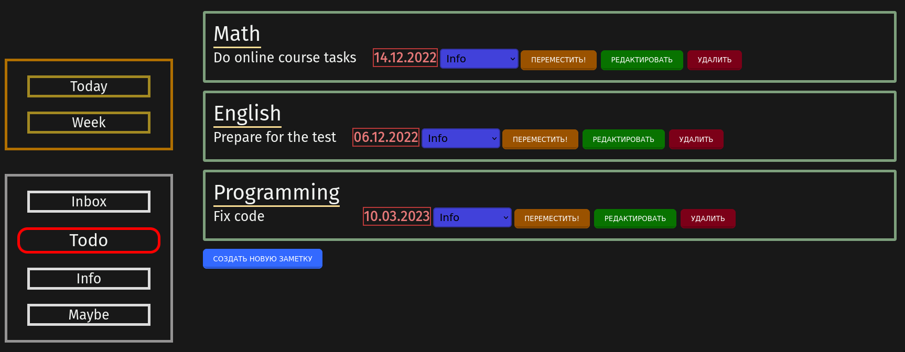
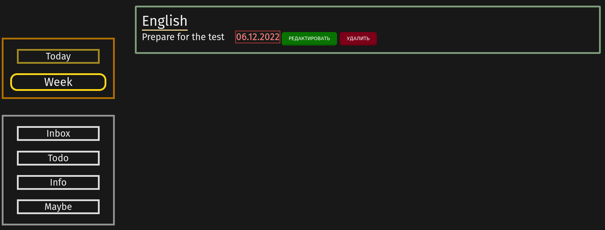
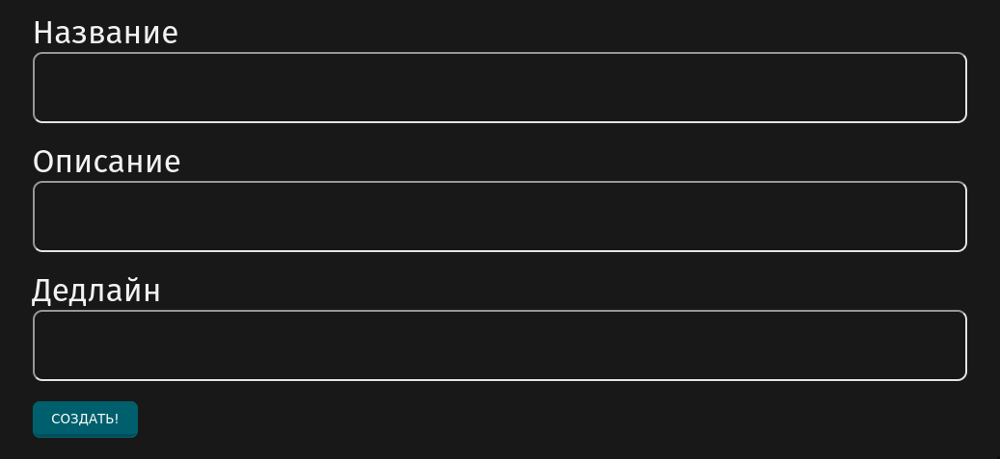
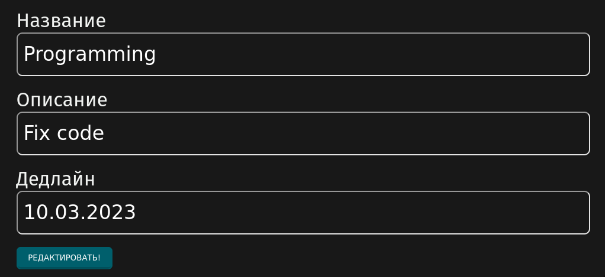
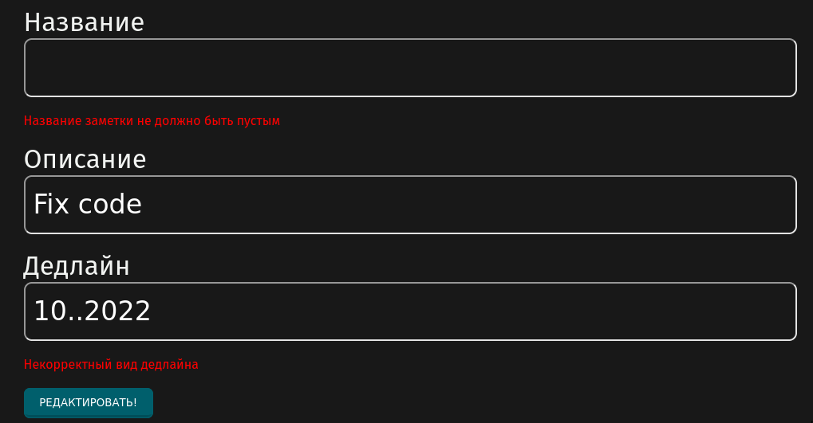

# GtdWebAppSpringBoot
## Spring Boot приложение для ведения заметок с помощью методики Getting Things Done (https://ru.wikipedia.org/wiki/Getting_Things_Done)


Приложение поддерживает создание новых заметок, добавление им названия, описания и дедлайна. Заметки можно редактировать, удалять и перемещать в различные папки

В левой частии приложения находится навигационная панель, в которой указано, в какой папке сейчас находится пользователь, а также можно перемещаться по всем папкам


Также присутствует 2 папки дедлайнов:
+ Папка Today Deadlines: в нее попадают заметки, дедлайн которых истекает сегодня
+ Папка Week Deadlines: в нее попадают заметки, дедлайн которых истекает в течение 7 дней

## Приложение может принимать следующие запросы:
1. GET: /{directory_name} - страница определенной папки, в которой отображены все её заметки.
2. GET: /new - форма для создания новой заметки. После создания заметки она валидируется и в случае успешной валидации она добавляется в папку, в которой была нажата кнопка "Создать новую заметку". После этого происходит переход на страницу этой папки
3. GET: /{id}/edit - редактирование заметки с определенным id. После введения новых данных заметка валидируется, и происходит переход в ту папку, где находится заметка
4. POST: /{directory_name} - добавление новой заметки в определенную папку
5. PATCH: /{id} - перемещение заметки в другую папку
6. PATCH: /{directory_name}/{id}/edit - изменение данных заметки (название, описание, дедлайн)
7. DELETE: /{id} - удаление заметки из папки. После удаления осуществляется переход в папку, где находилась заметка до удаления

## Стек технологий:
1. Java
2. Spring Framework + Spring MVC + Spring Boot + Spring Validator
3. PostgreSQL + Hibernate + Spring Data JPA
4. Thymeleaf
5. CSS
6. Maven

## Информация о БД
В проекте использовалась БД PostgreSQL (+ Hibernate и Spring Data JPA). Существует 3 таблицы
1. Note - информация о заметках (название, описание, дедлайн)
2. Directory - информация о названиях папок
3. Note_Directory - информация, какая заметка в какой папке находится. Отношение Many-To-Many, потому что одна заметка одновременно может находиться в какой-либо папке и в папке с дедлайном

+ Таблица Note:
```sql
create table note
(
    id          integer generated by default as identity
        primary key,
    name        varchar not null
        constraint note_name_check
            check (length((name)::text) < 80),
    description varchar
        constraint note_description_check
            check (length((description)::text) < 500),
    deadline    varchar
        constraint note_deadline_check
            check ((length((deadline)::text) > 9) AND (length((deadline)::text) < 11))
);
```
+ Таблица Directory:
```sql
create table directory
(
    id   integer generated by default as identity
        primary key,
    name varchar not null
        unique
        constraint directory_name_check
            check ((length((name)::text) > 3) AND (length((name)::text) < 20))
);
```

+ Таблица Note_Directory
```sql
create table note_directory
(
    note_id      integer not null,
    directory_id integer not null,
    primary key (note_id, directory_id)
);

```

## Интерфейс приложение (Thymeleaf + CSS)
1. /directories/todo



2. /directories/week



3. /notes/new



4. /notes/{id}/edit



5. /notes/{id}/edit - если не прошла валидация ()


